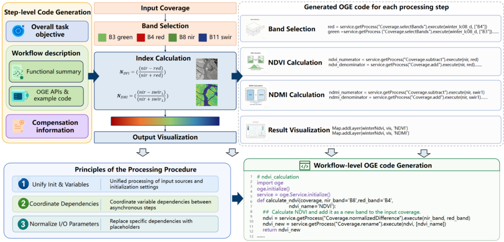
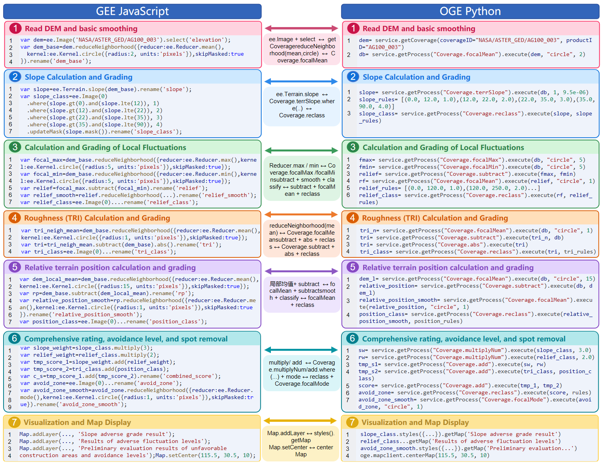

# 🔄 GEE2OGE — Stepwise Synthesis for Cross-Platform Geospatial Code Migration

**GEE2OGE** is a stepwise-synthesis framework for migrating **Google Earth Engine (GEE)** JavaScript workflows to the **Open Geospatial Engine (OGE)** Python platform. It decomposes complex remote-sensing workflows into semantically coherent steps, performs operator-level mapping with a curated knowledge base, generates step-level code in parallel, and finally reconstructs an executable OGE workflow with feasibility-aware compensation.

The core algorithm package in this repository is deliberately decoupled from application-layer components (Flask routes, web UI, databases, caching, background jobs, and LLM HTTP clients), making it suitable for research on cross-platform geospatial code migration, API alignment, and workflow-level code generation.

---

## 📌 Overview

GEE and OGE share similar conceptual models (raster/vector data, chained operator calls, map visualization) but differ substantially in API naming, parameter conventions, initialization patterns, and service-oriented invocation. Direct one-shot translation by LLMs often produces syntactically invalid or semantically inconsistent OGE code.

GEE2OGE addresses this challenge through a **six-step stepwise-synthesis pipeline**:

1. **Semantic Abstraction** — extracts the overall task goal, variable types, API calls, and data-flow structure from the source GEE script.
2. **Step-level API Requirement Identification** — identifies which GEE APIs are needed at each workflow step and infers the corresponding OGE operator requirements.
3. **Cross-platform API Alignment** — matches GEE APIs to OGE operators using a structured mapping library with one-to-one, one-to-many, many-to-one, and many-to-many combo matching.
4. **Feasibility Assessment & Compensation** — detects unmappable or missing APIs and injects compensation strategies (native Python fallbacks, alternative operator chains, placeholder markers).
5. **Step-level Code Generation** — generates composable OGE Python code for each step in parallel, using step-specific context and mapped operator examples.
6. **Workflow-level OGE Code Generation** — unifies variable initialization, coordinates inter-step dependencies, normalizes I/O parameters, and assembles the final executable OGE workflow.



> **Figure 1.** Stepwise-synthesis pipeline of GEE2OGE. Each step is generated independently and then assembled into a unified OGE workflow through three coordination principles: unified init & variables, coordinate dependencies, and normalized I/O parameters.

---

## 🎬 Demo Examples

Watch GEE2OGE in action — the demo shows the full stepwise conversion pipeline from GEE JavaScript to OGE Python, including semantic analysis, API mapping, step-code generation, and workflow reconstruction.

<p align="center">
  <a href="images/920.mp4">
    
  </a>
</p>

> **Figure 2.** Live demo of the GEE2OGE web interface. The pipeline executes six steps in sequence — semantic summarization, step-level API requirement identification, cross-platform API alignment, capability-aware workflow compensation, step-level code generation, and workflow-level OGE code generation — to produce a complete, runnable OGE Python script.

---

## 🔍 GEE ↔ OGE Code Comparison

The figure below shows a side-by-side comparison of a 7-step terrain analysis workflow in GEE JavaScript (left) and the corresponding OGE Python code generated by GEE2OGE (right). Each step is mapped with precise operator correspondences.



> **Figure 3.** Step-by-step GEE-to-OGE migration of a terrain analysis workflow. Colored boxes indicate corresponding steps; the central annotations list the GEE-to-OGE operator mappings used (e.g., `ee.Image + select → Coverage.reduceNeighborhood + Coverage.focalMean`, `ee.Terrain.slope → Coverage.terrSlope.where + Coverage.reclass`).

---

## 📂 Repository Layout

```text
gitCode/
├── main.py                         # Command-line entry point
├── README.md                       # Package overview and usage
├── dependency.md                   # Dependencies and runtime boundaries
├── core/
│   ├── analysis.py                 # GEE static analysis: step segmentation, type inference, API extraction
│   ├── preprocessing.py            # Source-code preprocessing algorithms
│   ├── workflow.py                 # Data-flow graph construction, topological sort, cycle detection
│   ├── mapping.py                  # Mapping library loading, combo matching, batch lookup
│   ├── converter.py                # Rule-based GEE ↔ OGE code skeleton generation
│   ├── validation.py               # Input, mapping, and output validation rules
│   ├── native_algorithms.py        # Pure-Python remote sensing and spatial analysis algorithms
│   └── evaluation.py               # Graph similarity evaluation: NMR / EMR / TS metrics
├── docs/
│   └── ALGORITHM_CATALOG.md        # Algorithm catalogue and four-strategy descriptions
├── examples/                        # Runnable analysis and spatial algorithm examples
├── tests/                           # Unit tests
├── images/                          # Figures used in README and documentation
├── demo_video/                      # Full MP4 demo videos (to be added)
├── requirements.txt                 # Optional numerical dependencies
├── pyproject.toml                   # Install/test metadata
└── data_resources/
    ├── source_code/                # GEE source-code examples
    ├── converted_code/             # OGE converted-code examples
    └── mappings/                   # Core operator mappings (JSON format)
```

---

## 🧠 Included Algorithms

### GEE Static Analysis (`core.analysis`)

- Comment-based workflow step segmentation, with separator-comment detection and step-coverage validation
- Global variable-type inference: Image, Collection, Geometry, Number, Date, List, Dictionary
- API recognition for constructors, static methods, Map/Export calls, and instance methods
- Chain-call extraction via bracket counting (supports nested arguments)
- Key-parameter extraction: dataset IDs, band names, index names, dates, geometry coordinates, map settings

### Data-Flow Analysis (`core.workflow`)

- Statement extraction and variable-reference analysis
- Directed dependency-graph construction
- Stable topological ordering (Kahn's algorithm with cycle fallback)
- Cycle detection (Tarjan's strongly connected components algorithm)
- Level/depth computation, root-node and leaf-node identification

### Mapping Library & Matching (`core.mapping`)

- JSON-backed GEE-to-OGE operator mapping library (125 core mappings)
- Forward lookup (GEE → OGE) and reverse lookup (OGE → GEE)
- Five mapping types: `one_to_one`, `one_to_many`, `many_to_one`, `many_to_many`, `native_python`
- **Combo matching algorithm**: greedy strategy sorted by combo size descending + scarcity ascending
- Match-rate calculation, missing-API statistics, feasibility classification
- API lookup-table construction (for code generation consumption)

### Rule-Based Conversion (`core.converter`)

- Mapping-driven GEE → OGE code skeleton generation
- Code generation for all five mapping types
- Code organized by workflow steps with feasibility labels
- OGE → GEE reverse conversion drafts
- Mapping context formatting utilities (for LLM-assisted code generation)

### Validation Rules (`core.validation`)

- GEE source checks: empty input, bracket/quote balance, API recognition
- Mapping-coverage checks
- OGE workflow checks: duplicate initialization, placeholders, missing APIs
- Mapping-library internal consistency checks

### Code Preprocessing (`core.preprocessing`)

- Code normalization (line endings, trailing whitespace)
- Python comment and docstring cleanup
- JavaScript comment cleanup (line comments + block comments)
- Line counting, import extraction, dedent

### Graph Similarity Evaluation (`core.evaluation`)

- **AST-to-graph**: build data-flow dependency graphs from OGE Python code
- **Regex fallback**: regex-based extraction when AST parsing fails
- **NMR** (Node Match Rate): node-level F1 score
- **EMR** (Edge Match Rate): edge-level F1 score
- **TS** (Topological Similarity): combined node+edge weighted score with size penalty
- Paper metrics: Node_Precision / Recall / F1 / LAM / PA / LD
- Multi-graph merging, metric aggregation, token-level similarity

### Native Remote-Sensing Algorithms (`core.native_algorithms`)

- Pixel-wise operations: exponential transform, matrix multiplication, random raster generation, value scaling
- Normalized indices: NDVI, GNDVI, NDMI, generic normalizedDifference
- Statistical reduction: mean / sum / max / min / median / std / var / count
- Neighborhood filtering: focal mean/sum, median filtering
- Terrain analysis: slope, aspect, hillshade, terrain products
- Image processing: connected-pixel count, Canny/Sobel edge detection
- Classification accuracy: user's accuracy, producer's accuracy, overall accuracy, Kappa coefficient
- Radiometric calibration: simplified linear Landsat TOA calibration

---

## 📊 Evaluation Metrics

The benchmark uses both code-level and workflow-level structural metrics:

| Metric | Description |
| ------ | ----------- |
| **NMR** | Node Matching Rate — F1 score of operator nodes between generated and reference DAGs. |
| **EMR** | Edge Matching Rate — F1 score of data-flow edges between generated and reference DAGs. |
| **TS** | Topological Similarity — combined node+edge weighted score with graph-size penalty. |
| **Node Precision/Recall/F1** | Standard node-level classification metrics. |
| **LAM** | Levenshtein-based Alignment Metric — sequence-edit-distance similarity. |
| **PA** | Parameter Accuracy — correctness of operator parameters. |
| **LD** | Layer Depth consistency — depth-level alignment in the workflow hierarchy. |

---

## 🚀 Quick Start

Run from the `gitCode` directory:

### 1. Environment Setup

```bash
# Core algorithms depend only on the Python standard library
# Optional numerical dependencies (for native_algorithms):
pip install -r requirements.txt
```

### 2. Static Analysis of GEE Code

```bash
python main.py analyze-gee data_resources/source_code/ndvi_calculator_gee.js
```

### 3. GEE → OGE Rule-Based Conversion

```bash
python main.py gee-to-oge data_resources/source_code/ndvi_calculator_gee.js -o output_oge.py
```

### 4. OGE → GEE Reverse Conversion

```bash
python main.py oge-to-gee data_resources/converted_code/ndvi_calculator_oge.py -o output_gee.js
```

### 5. Run Unit Tests

```bash
python -m unittest discover -s tests -v
```

---

## 🧩 Four Conversion Strategies

The full GEE2OGE system (parent repository) implements four conversion strategies for comparative evaluation:

| Strategy | Description |
| -------- | ----------- |
| **GEE2OGE · Stepwise Synthesis** | Full six-step pipeline with parallel step-code generation and workflow-level reconstruction (the proposed method). |
| **baseline1 · Direct Rules** | Semantic goal extraction + direct rule-based code generation without step decomposition. |
| **baseline2 · All APIs Direct** | All mapped APIs are provided at once; the LLM generates the entire OGE workflow in a single pass. |
| **baseline3 · Step Plan + APIs** | A step plan is generated first, then the LLM follows the plan to produce the final code in one shot. |

See [`docs/ALGORITHM_CATALOG.md`](docs/ALGORITHM_CATALOG.md) for detailed algorithm descriptions and strategy comparisons.

---

## 📚 Extending the Mapping Library

Append records to `data_resources/mappings/core_operator_mappings.json`:

```json
{
  "gee_api": "ee.Image.normalizedDifference",
  "gee_api_names": ["ee.Image.normalizedDifference"],
  "oge_apis": ["Coverage.subtract", "Coverage.add", "Coverage.divide"],
  "mapping_type": "one_to_many",
  "mapping_name": "Normalized Difference Index",
  "note": "(band1 - band2) / (band1 + band2)",
  "gee_example": "",
  "oge_example": "",
  "python_implementation": "",
  "confidence": 0.95
}
```

Combo mapping (`many_to_one`) example:

```json
{
  "gee_api": "ee.Image.select",
  "gee_api_names": ["ee.Image.select", "ee.Image.subtract", "ee.Image.divide"],
  "oge_apis": ["Coverage.NDVI"],
  "mapping_type": "many_to_one",
  "mapping_name": "NDVI Combo",
  "note": "select + subtract + divide → direct NDVI operator call",
  "confidence": 0.9
}
```

The converter does not invent coverage IDs, product IDs, spatial references, resolutions, or process arguments. Such information is retained as explicit `TODO` markers or placeholders so that generated workflows remain reviewable.

---

## 💡 Design Principles

1. **Pure-algorithm focus**: no Flask, database, LLM, caching, or other application-layer dependencies
2. **Zero external services**: core algorithms depend only on the Python standard library (+ NumPy, optional)
3. **Function-level documentation**: every public function has a Chinese docstring
4. **Independently runnable**: all modules can be imported and tested in isolation
5. **Data-driven**: mapping data is separated from algorithms for easy extension and audit

---

## 📖 Citation

If you use GEE2OGE in academic work, please cite the corresponding paper once it is published.

```bibtex
@article{GEE2OGE2026,
  title   = {Stepwise Synthesis for Cross-Platform Geospatial Code Migration: From Google Earth Engine to Open Geospatial Engine},
  author  = {Wenjie Chen, Jianyuan Liang*, Longgang Xiang, Huayi Wu},
  journal = {Manuscript under review},
  year    = {2026}
}
```

---

## 📬 Contact

For questions, issues, or collaboration, please contact: [chenwenjie_ws@whu.edu.cn](mailto:chenwenjie_ws@whu.edu.cn)
